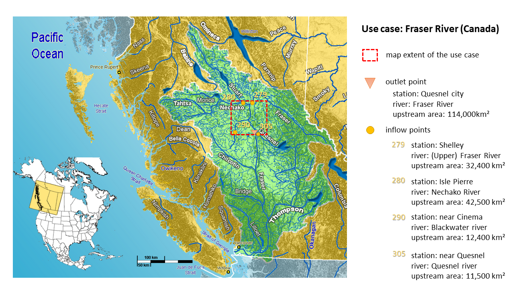
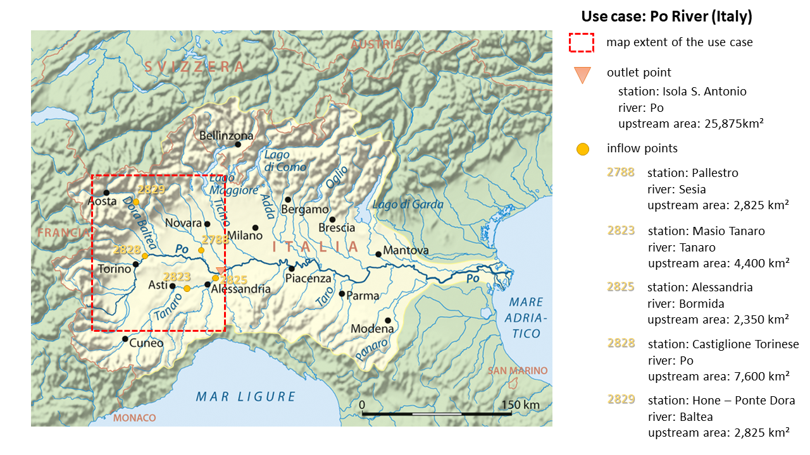

# Lisflood use cases

This repository hosts two use cases for the LISFLOOD model. The purpose of those use cases is for you to get kick-started with LISFLOOD as well as to give you the opportunity to verify that the model is running correctly on your PC. For you to be able to do that we have prepared for each of the two use cases all the static input maps, the meteorological forcings and the LISFLOOD setting files. Once you have downloaded and installed the LISFLOOD model on your own PC, we recommend you to download also one (or both) of the use cases and run as a test on your PC. In order for you to know that everything has worked correctly we have uploaded the reference output file. If everything has worked correctly your output file is identical to the reference one.

The [model documentation](https://ec-jrc.github.io/lisflood-model/) provides a detailed description of the modelling of the hydrological processes; the [user guide](https://ec-jrc.github.io/lisflood-code/) provides the guidelines for the set-up of a simulation.   

**NOTE about the static maps made available by this repository**: all the 0.1 degrees static maps of the Fraser catchment and all the 5km static maps of the Po basin were produced following [these guidelines](https://ec-jrc.github.io/lisflood/pdfs/Dataset_hydro.pdf). The [user guide](https://ec-jrc.github.io/lisflood-code/) presents the updated protocol for the preparation of the static maps. The [updated protocol](https://ec-jrc.github.io/lisflood-code/4_Static-Maps-introduction/) relies on the most recent (up to 2021) research findings and data sets (both remote sensing data sets and in-situ measurements). Differences between the static maps produced using the [previous guidelines](https://ec-jrc.github.io/lisflood/pdfs/Dataset_hydro.pdf) and the [updated protocol](https://ec-jrc.github.io/lisflood-code/4_Static-Maps-introduction/) are expected.

## Use case 1: Fraser River, British Columbia, Canada  

### Short description 
The first use case is located in West Canada, in a basin called Fraser. The Fraser River rises at Fraser Pass near Blackrock Mountain in the Rocky Mountains and discharges into the Pacific Ocean at the city of Vancouver. With its 1,375 km length, it is the longest river within British Columbia and the 11th longest river in Canada. The basin size is about 220,000 km2, while the annual discharge at its mouth is 3,550 m3.

For testing the LISFLOOD code we prepared all the required input (maps) for a subsection of the Fraser basin (see red dashed box in Figure above). The maps cover the river section from the Nechako tributary in the North till the Quesnel tributary in the South. The outlet point of our test case is located on the main Fraser river at the hight of the Quesnel city and has an upstream area of 114,00 km2. As our subsection covers only a relatively small portion of the outlet's upstream catchment, four inlet points have been implemented (called Shelley, Isle Pierre, near Cinema and near Quesnel) accounting for the discharge (of the Upper Fraser, Nechako, Blackwater and Quesnel river respectively) prior to "inflowing" into our map area.   

As this is a use case from our global setup, all input maps are in the geographical system WGS84, with latitude and longitude. The map extent is 52.6o to 54o North and -121.4o to -124.5o West, with a horizontal resolution of 0.1 degree. The standard map format is netCDF.

### How to get it running

Before of getting started, let's have a look at the inventory of files belonging to the Fraser use case. You can find them in the [parent folder](https://github.com/ec-jrc/lisflood-usecases/tree/master/LF_lat_lon_UseCase):
- [two pre-edited LISFLOOD settings files](https://github.com/ec-jrc/lisflood-usecases/tree/master/LF_lat_lon_UseCase):
  - *settings_lat_lon-PreRun.xml* for the warm up, i.e. initialization of the hydrological model and 
  - *settings_lat_lon-Run.xml* for the actual simulation.
- [folder: *maps*](https://github.com/ec-jrc/lisflood-usecases/tree/master/LF_lat_lon_UseCase/maps), [folder: *landuse*](https://github.com/ec-jrc/lisflood-usecases/tree/master/LF_lat_lon_UseCase/landuse) include the static maps of the Fraser river subsection, with information on soil, topography, channel geometry,landuse, etc. 
- [folder: *meteo*](https://github.com/ec-jrc/lisflood-usecases/tree/master/LF_lat_lon_UseCase/meteo) contains all the meteorological input data, such as daily precipitation, average temperature and evapotranspiration from 02.01.1986 till 01.01.2018; [folder: *inflow*](https://github.com/ec-jrc/lisflood-usecases/tree/master/LF_lat_lon_UseCase/inflow) contains the discharge time series of the four input points, from 02.01.1986 to 01.01.2018.
For general information on LISFLOOD input files see [here](https://ec-jrc.github.io/lisflood-code/4_annex_input-files/)
- [*streamflow_simulated_lat_lon.csv*](https://github.com/ec-jrc/lisflood-usecases/blob/master/LF_lat_lon_UseCase/streamflow_simulated_lat_lon.csv) is the reference output file. Use this file to compare against your own model simulation, if they are identical you are sure that LISFLOOD is running correctly on your PC.

Okay let's get started. Follow the steps below to execute the use case on your PC: 
1. If you haven't installed LISFLOOD yet, please do that first. You find the model [here](https://github.com/ec-jrc/lisflood-code) and also the [installation instructions](https://ec-jrc.github.io/lisflood-code/3_step2_installation/). Note: if possible, please install it on a LINUX system as it has shown to work more reliable on that system. 
2. Once you have completed step 1, download all the [files belonging to the Fraser use case](https://github.com/ec-jrc/lisflood-usecases/tree/master/LF_lat_lon_UseCase) to your local drive, please keep the folder structure as it is in the Github repository as LISFLOOD will expect them like that. 
3. Open the LISFLOOD settings files on your local conputer and adapt the path names (so they fit to your local dirves): *PathRoot*, *MaskMap*, *PathRoot*, *PathParams*, and *PathTables*. Please remember to do that for both settings files as else you will run into problems very soon.
TIP:  You can use *$(ProjectDir)* or *$(ProjectPath)* as built-in variable to use in this XML settings, to refer the project folder.
4. Create a folder called *out* in the same parent folder on your local drive, to provide LISFLOOD with a designated space to save your model output
5. Open a command window and execute LISFLOOD. First you have to do the pre-run to initialize the model for that you have to execute LISFLOOD with the following settings file: *settings_lat_lon-PreRun.xml*. Once that is completed, check the *out* folder, you should find a file called lzavin in there. If that's the case you can launch the actual LISFLOOD run by execting LISFLOOD with the *settings_lat_lon-Run.xml* settings file. This should produce a file called *dis.tss* in your *out* folder. The *dis.tss* contains the simulated discharge at the outlet point.
6. Compare the *dis.tss* with the *streamflow_simulated_lat_lon.csv* to verify the correct installation and running of LISFLOOD.

[What's next?](#next)

## Use case 2: Po River, Italy 

### Short description 
The second use case is located in North Italy, in the Po River Basin. Its source is at Monte Viso in Piemonte (Italy) at about 3,700 m; from there it flows 652 km eastwards till it flows into the Adriatic Sea close to Venice. The whole basin covers about 74,000 km², of which 70,000 km² are on Italian territory, and the remaining are shared between France and Switzerland. The average annual discharge at the river mouth is about 1,540 m³/s, whereas the maximum is about double of that.

Also for this use case we have selected only a portion of the whole river basin. You can see the selected area in the map above as it is outlined with a red dashed box. It includes a large part of the Upper Po River basin till the outlet at Pieve del Cairo on the main Po River. The area upstream of the outlet is 25,875 km². However, as not all of the very upstream sections are fully included in the map extent (you see that some are outside of the red box) five inflow points were defined (see map). At those locations a pre-calculated discharge time series will be used that accounts also for all the upstream areas.

As this use case is from our European setup, all the input maps are in the SPIRE compliant ETRS89 Lambert Azimuthal Equal Area Coordinate Reference System (ETRS-LAEA). The extent of the prepared input maps for this use case is 2535000 (top), 4095000 (left), 4230000 (right) and 2380000 (bottom). The horizontal resolution is 5 km and the standard map format is netCDF.

### How to get it running

This section is pretty much a repetition of the one on the top for the Frasers river, but adapted for the use case on the Po river basin. We are going to repeat it here as the links to the files are different and also because you might not have done the one on the Fraser river.

Before of getting started, let's have a look at the inventory of files belonging to the Po use case. You can find them in the [parent folder](https://github.com/ec-jrc/lisflood-usecases/tree/master/LF_ETRS89_UseCase):
- [two pre-edited LISFLOOD settings files](https://github.com/ec-jrc/lisflood-usecases/tree/master/LF_ETRS89_UseCase):
  - *settings_ETRS89-PreRun.xml* for the warm up, i.e. initialization of the hydrological model and 
  - *settings_ETRS89-Run.xml* for the actual simulation.
- [folder: *maps*](https://github.com/ec-jrc/lisflood-usecases/tree/master/LF_ETRS89_UseCase/maps) includes the static maps of the Po river subsection, with information on soil, topography, channel geometry, etc. 
- [folder: *landuse*](https://github.com/ec-jrc/lisflood-usecases/tree/master/LF_ETRS89_UseCase/landuse) contains information on land use.
- [folder: *meteo*](https://github.com/ec-jrc/lisflood-usecases/tree/master/LF_ETRS89_UseCase/meteo) contains all the meteorological input data, such as daily precipitation, average temperature and evapotranspiration from 02.01.1990 till 31.12.2017; [folder: *inflow*](https://github.com/ec-jrc/lisflood-usecases/tree/master/LF_ETRS89_UseCase/inflow) contains the discharge time series at the five input points, from 02.01.1990 to 31.12.2017.
- [folder: *tables*](https://github.com/ec-jrc/lisflood-usecases/tree/master/LF_ETRS89_UseCase/tables) contains information on rice irrigation and reservoir operation.
For general information on LISFLOOD input files see [here](https://ec-jrc.github.io/lisflood-code/4_annex_input-files/)
- [*streamflow_simulated_ETRS89.csv*](https://github.com/ec-jrc/lisflood-usecases/blob/master/LF_ETRS89_UseCase/streamflow_simulated_ETRS89.csv). Is the reference output file. Use this file to compare against your own model simulation, if they are identical you are sure that LISFLOOD is running correctly on your PC.

Okay let's get started. Follow the steps below to execute the use case on your PC: 
1. If you haven't installed LISFLOOD yet, please do that first. You find the model [here](https://github.com/ec-jrc/lisflood-code) and also the [installation instructions](https://ec-jrc.github.io/lisflood-code/3_step2_installation/). Note: if possible, please install it on a LINUX system as it has shown to work more reliable on that system. 
2. Once you have completed step 1, download all the [files belonging to the Po use case](https://github.com/ec-jrc/lisflood-usecases/tree/master/LF_ETRS89_UseCase) to your local drive, please keep the folder structure as it is in the Github repository as LISFLOOD will expect them like that. 
3. Open the LISFLOOD settings files on your local conputer and adapt the path names (so they fit to your local dirves): *PathRoot*, *MaskMap*, *PathRoot*, *PathParams*, and *PathTables*. Please remember to do that for both the settings files as else you will run into problems very soon.
TIP:  You can use *$(ProjectDir)* or *$(ProjectPath)* as built-in variable to use in this XML settings, to refer the project folder.
4. Create a folder called *out* in the same parent folder on your local drive, to provide LISFLOOD with a designated space to save your model output
5. Open a command window and execute LISFLOOD. First you have to do the pre-run to initialize the model for that you have to execute LISFLOOD with the following settings file: *settings_ETRS89-PreRun.xml*. Once that is completed, check the *out* folder, you should find two netCDF files called *avgdis009026175600* and *lzavin009026175600*. If that's the case you can launch the actual LISFLOOD run by execting LISFLOOD with the *settings_ETRS89-Run.xml* settings file. This should produce a file called *dis.tss* in your *out* folder. The *dis.tss* contains the simulated discharge at the outlet point.
6. Compare the *dis.tss* with the *streamflow_simulated_ETRS89.csv* to verify the correct installation and running of LISFLOOD.

## What's next? 

If everything went alright you can be sure that the LISFLOOD runs correctly on your PC and you are ready to set it up for your own area. By the number of input maps you can tell that this is not going to be an easy exercise as LISFLOOD is quite complex and requires several input information. By making available those two use cases we hope to facilitate you to understand how LISFLOOD works and what input information it requires. We recommend you to read carefully the documentation on the input data, so that you can prepare them for your own area. As a good practice we recommend you to replace one map at a time and see if LISFLOOD is still running as that will help you to understand where things went wrong in the case that the model has stopped working.
